# Benewake(北醒) TF-Luna (TTL) 雷达在WiFi LoRa 32 (V3)基于Arduino IDE上的垃圾桶检测项目


# 一.前言
::: alert-info

   在日常的垃圾桶清洁工作中，环卫工人每天都要经常巡逻查看垃圾桶是否装满，有时垃圾桶已经满溢，却没有及时清理，造成垃圾苍蝇满天飞，周围环境恶化，有时候垃圾桶却还是空的导致白跑一趟，不仅仅浪费时间和精力，也产生了额外的垃圾收运车燃油费等额外费用，特别是遇上高温或者下雨寒冷等恶劣天气，更是费时费力。
   在此背景下设计了一套基于Benewake(北醒) TF-Luna (TTL) 雷达的低成本、小体积、低功耗、可组网、适应性强的垃圾桶检测装置。
   项目目标：可通过低功耗蓝牙连接，对不同垃圾桶的空置和满溢状态进行标记，自定义修改检测的和上报垃圾桶状态的周期，查看垃圾桶状态。也可以直接使用串口指令进行，以上数据的配置。通过LoRa无线通信协议，实现远距离查看的垃圾桶的状态。当垃圾桶满溢时能自动预警。

:::
----


# 二.硬件介绍

   | 物料     |  数量   |
   | --- | --- |
   |   HELTEC ESP32 Boards v3  |  x2   |
   |      TF-Luna (TTL)            |   x1   |
   |     Android手机        |   x1   |
## 1.TF-Luna 简要说明
   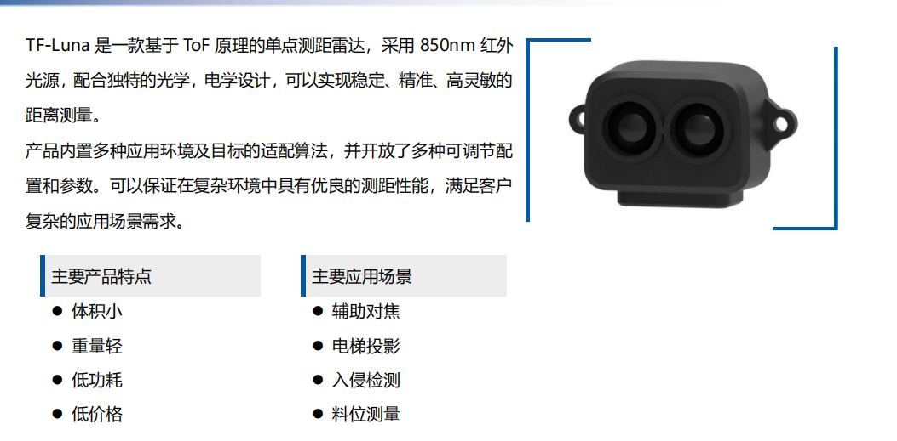{:width="50%"}

**相关链接：https://blog.csdn.net/zoran_wu/article/details/121850480**
## 2.WiFi LoRa 32 (V3)
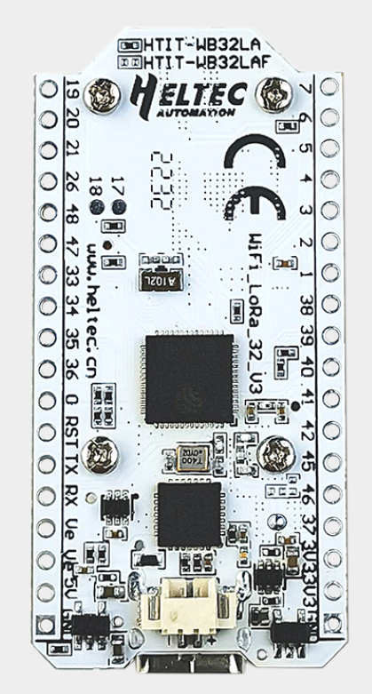     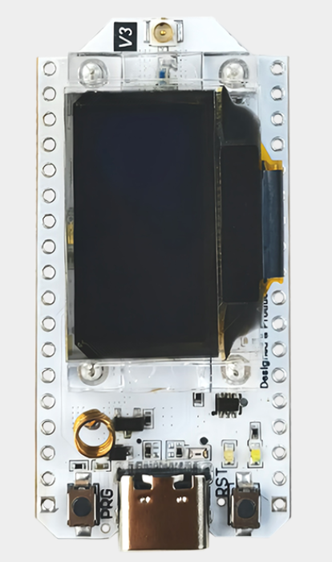


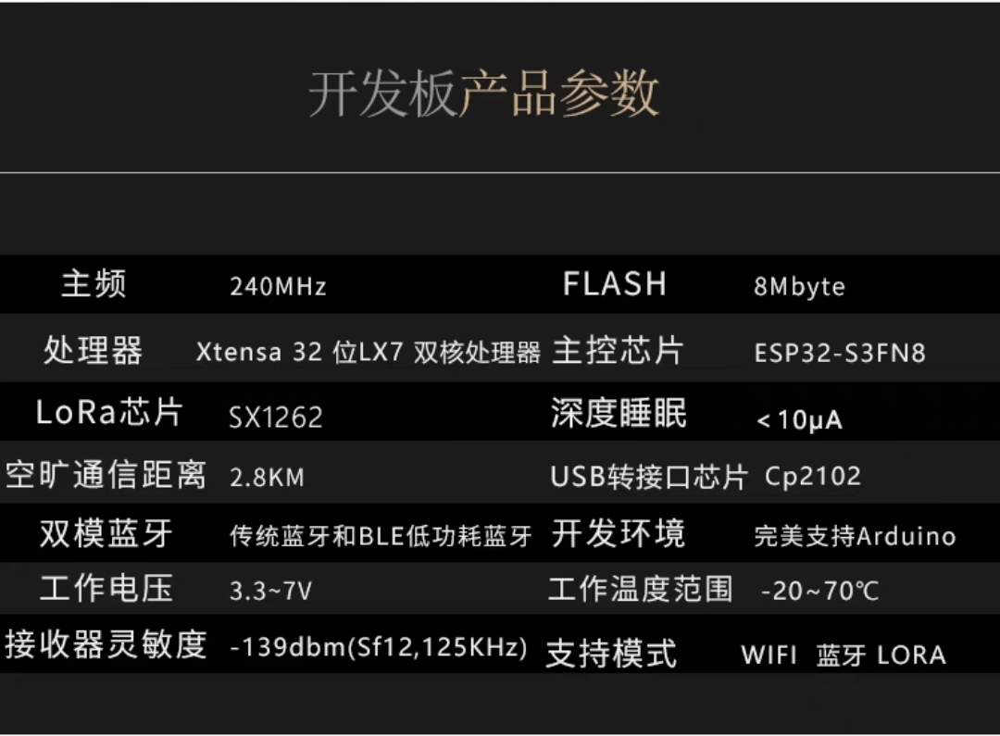
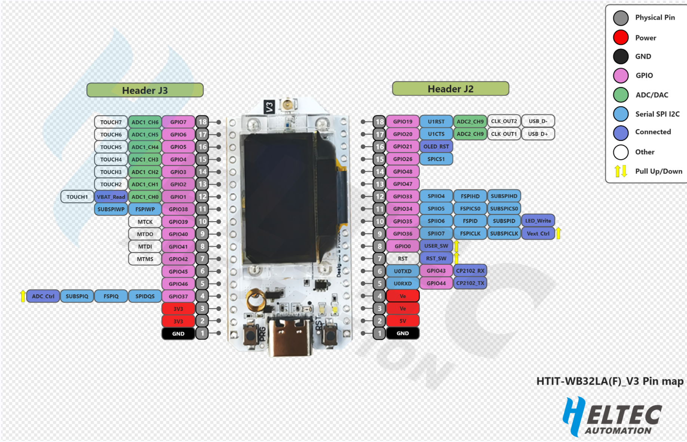
官方资料请参考 :
https://heltec.org/project/wifi-lora-32-v3/
https://docs.heltec.org/zh_CN/node/esp32/wifi_lora_32/index.html


-----

# 三.编译环境搭建
## 1.安装Arduino
 参考官方教程 https://docs.heltec.org/general/how_to_install_git_and_arduino.html
 下载地址： https://www.arduino.cc/en/Main/Software 
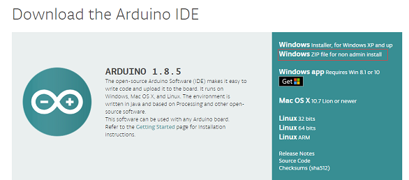
双击安装 Arduino 

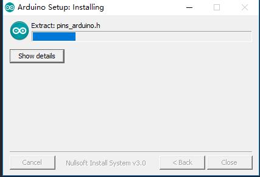

## 2.安装芯片包和查看例程

### **通过本地文件的方式**
官方教程：https://docs.heltec.org/zh_CN/node/esp32/wifi_kit_8/quick_start.html#via-local-file
下载开发环境：https://resource.heltec.cn/download/tools/WiFi_Kit_series.zip

> 1. 打开 Arduino IDE，然后单击 -> FilePeferences
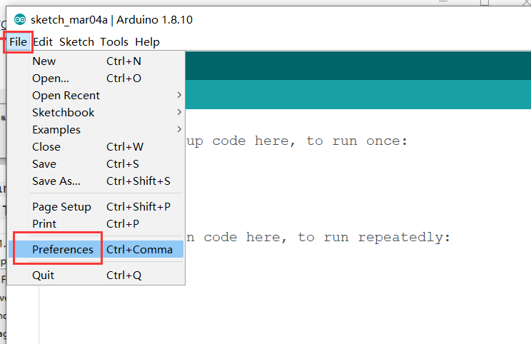
> 2. 转到红色框中的文件夹。
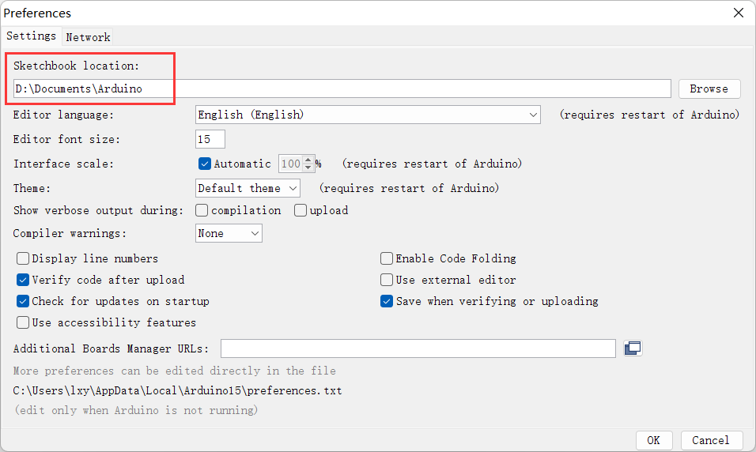
> 3. 在 Arduino 文件夹中创建一个新的“硬件”文件夹。如果已经有一个“硬件”文件夹，则无需创建新文件夹。
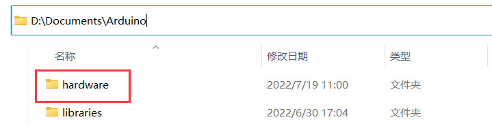
> 4. 转到“硬件”文件夹并将“WiFi_Kit_series”提取到此文件夹中。
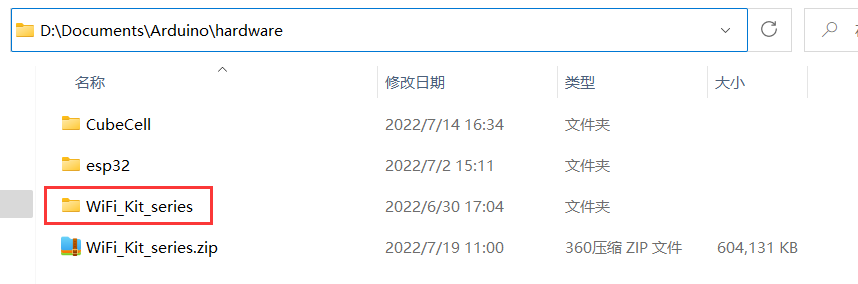
> 5. 进入“WiFi_Kit_series”文件夹，参考下图确认红框中的路径是否正确。
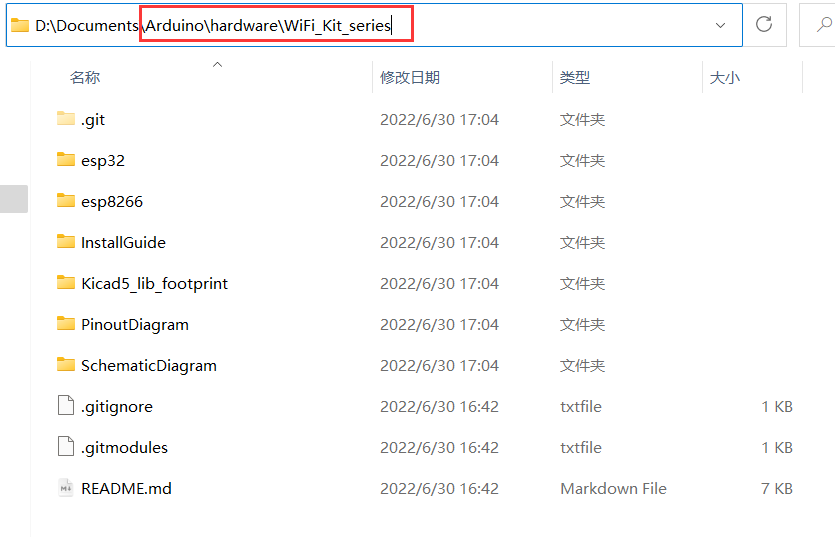
> 6. 重新启动 Arduino IDE，确认开发环境是否安装成功。
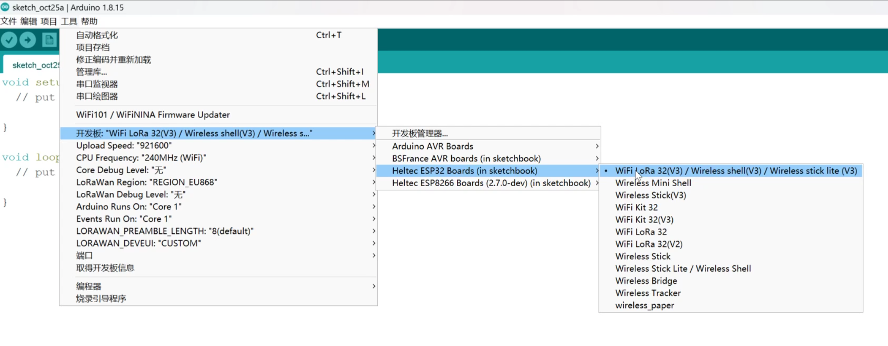


## 3.Android 蓝牙APP
**（需要带有文本显示和按键调试功能）**
例如：
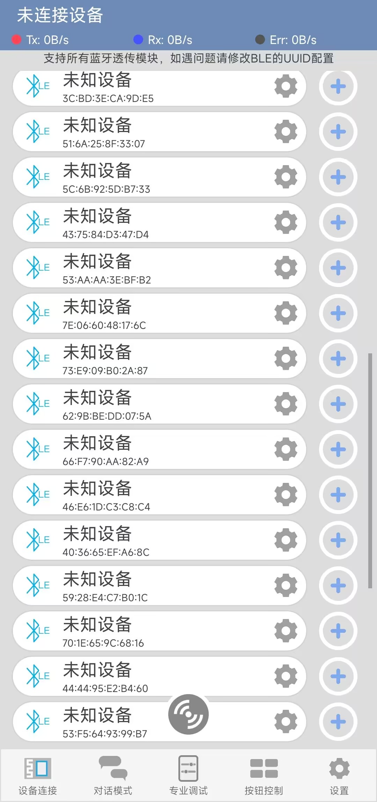
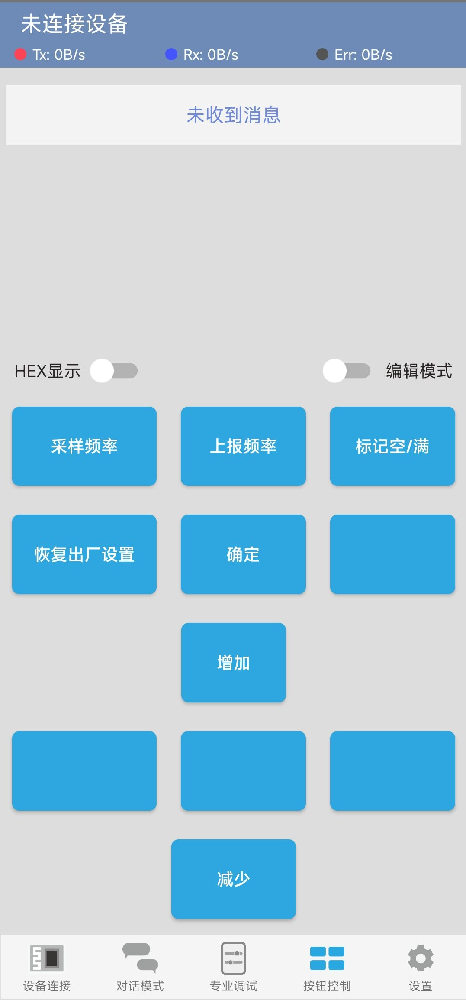


---
# 四.各功能模块设计
## 总体思路：
::: alert-info

复位状态下，数据为默认配置，并未标记垃圾桶空和满的两种状态，蓝牙APP端接收到文本“摁确定键标记 空状态” ， 在蓝牙APP端摁下确定，即可标定空置，随即自动进入标定满溢状态，显示  “摁确定键标记满状态”，摁下确定结束标定，系统开始根据采样间隔和上报间隔进行蓝牙和LoRa上报信息，显示为百分比。摁“设置采样间隔”  键可以修改雷达每次扫描的间隔，通过上下+确定键，进行修改，“设置上报间隔” 同理。垃圾桶装载超过80时，不再显示百分比，而是警报垃圾桶已满。
:::

## 1.测量端功能模块介绍
### （1）串口读取并处理雷达数据
**北醒TF-luna(TTL)协议说明**
     详细可参考北醒官网最新使用说明书：
     https://www.benewake.com/DataDownload/index_pid_20_lcid_21.html

::: alert-info

引脚 5 悬空或者接 3.3V 时，TF-Luna 启动为串口通信模式，引脚 2 为串口接收 RXD，引脚 3 为串口发送 TXD。
串口通信硬件协议为：数据位 8bit，停止位 1bit，无奇偶校验，默认波特率**115200bps**。

:::

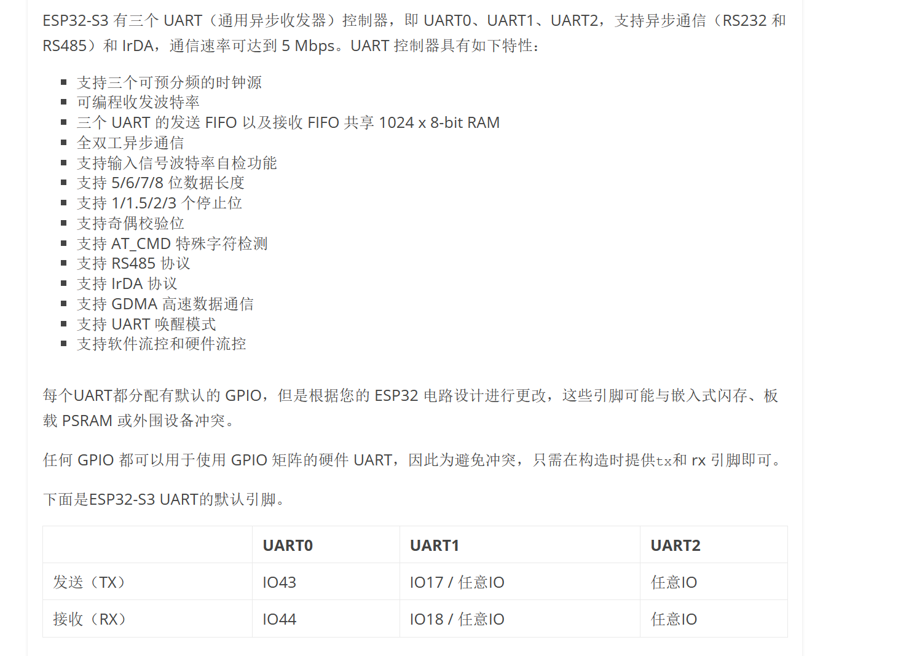
**硬件接线图：**

**串口2读取一帧数据，并用串口0打印出雷达距离信息的示例代码：**
```
#include "HardwareSerial.h"   
//雷达数据结构体
typedef struct {
  int distance = 0;        //距离
  int strength = 0;        //信号强度
  int ID   = 0;            //雷达 ID

  long int BaudRate = 0;

  boolean LidarFlag = false;
  boolean receiveComplete = false;
  boolean IO = 0;
} TF;
TF Lidar;

void getLidarData( TF* Lidar);

void setup() {
   Serial.begin(115200);  //串口0 用于打印调试
   Serial2.begin(115200, SERIAL_8N1, 45, 46);  //串口2用于读取雷达数据 绑定串口2的两个脚位 设置GPIO45是Rx，GPIO46是Tx
}

void loop() {
  getLidarData(&Lidar) ;
  Serial.print(Lidar.distance);
  Serial.println("cm");
  delay(500);
}


/* void getLidarData( TF* Lidar) 
   串口获取一帧数据，并计算距离，信号强度和记录成功计算的标志。
*/
void getLidarData( TF* Lidar)  
{ 
  //59 59 03 00 E9 09 68 09 18  一帧数据
  static char i = 0;
  char j = 0;
  int checksum = 0;
  Lidar->receiveComplete = false; 
  static int rx[9] ;
  while (Serial2.available() > 0) {
     rx[i] = Serial2.read();
    if (rx[0] != 0x59) {
      i = 0;
    } else if (i == 1 && rx[1] != 0x59) {
      i = 0;
    } else if (i == 8) {
      for (j = 0; j < 8; j++) {
        checksum += rx[j];      //计算校验和
      }
      if (rx[8] == (checksum % 256)) {
        Lidar->distance = rx[2] + rx[3] * 256;  //距离
        Lidar->strength = rx[4] + rx[5] * 256;  //信号强度
        Lidar->receiveComplete = true;          //接收完成
      }
      i = 0;
    } else {
      i++;
    }
   } 
}
```
串口信息：
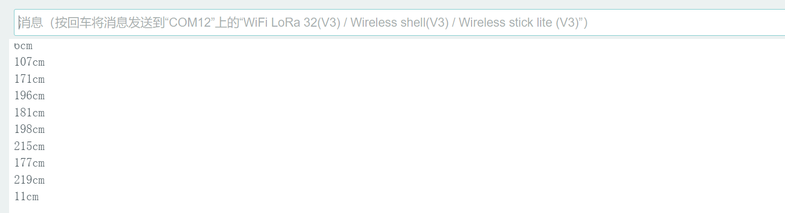

### （2）蓝牙配置数据双向传输
 **开启蓝牙服务，每秒钟广播特定的信息，识别出手机APP端摁下了哪个按键并用串口显示出来的示例代码：**
 ```/*
   使用步骤：
   1. 创建一个 BLE Server
   2. 创建一个 BLE Service
   3. 创建一个 BLE Characteristic
   4. 创建一个 BLE Descriptor
   5. 开始服务
   6. 开始广播

*/
#include <Arduino.h>
#include <BLEDevice.h>
#include <BLEServer.h>
#include <BLEUtils.h>
#include <BLE2902.h>
#include <stdio.h>
#include <string.h>

uint8_t txValue[] = "Hello";                 //需要发送的内容
char    Keydate = '0';
uint8_t KeyNum =  0 ,key = 0 ;
BLEServer *pServer = NULL;                   //BLEServer指针 pServer
BLECharacteristic *pTxCharacteristic = NULL; //BLECharacteristic指针 pTxCharacteristic
bool deviceConnected = false;                //本次连接状态
bool oldDeviceConnected = false;             //上次连接状态d
// See the following for generating UUIDs: https://www.uuidgenerator.net/
#define SERVICE_UUID "12a59900-17cc-11ec-9621-0242ac130002" // UART service UUID
#define CHARACTERISTIC_UUID_RX "12a59e0a-17cc-11ec-9621-0242ac130002"
#define CHARACTERISTIC_UUID_TX "12a5a148-17cc-11ec-9621-0242ac130002"
//根据已连接和未连接的情况改变标志位
class MyServerCallbacks : public BLEServerCallbacks
{
    void onConnect(BLEServer *pServer)
    {
        deviceConnected = true;
    };

    void onDisconnect(BLEServer *pServer)
    {
        deviceConnected = false;
    }
};

class MyCallbacks : public BLECharacteristicCallbacks
{
    void onWrite(BLECharacteristic *pCharacteristic)
    {
        std::string rxValue = pCharacteristic->getValue(); //接收信息

        if (rxValue.length() > 0)
        { //向串口输出收到的值
           Keydate = rxValue[0];                 
            switch(Keydate)  //判断是哪个按键
            {
              case 'A' : key = 1;break;
              case 'B' : key = 2;break;
              case 'C' : key = 3;break;
              case 'D' : key = 4;break;
              case 'E' : key = 5;break;
              case 'F' : key = 6;break;
              case 'G' : key = 7;break;
              case 'K' : key = 8;break;
            }
            if(Keydate == 'S')     //等待松开按键的动作
            {
                KeyNum = key;   //把按键信号存入标志位
            }
        }
    }
};

void setup()
{
    Serial.begin(115200);

    // 创建一个 BLE 设备
    BLEDevice::init("ESP32_BLE");//在这里面是ble的名称

    // 创建一个 BLE 服务
    pServer = BLEDevice::createServer();
    pServer->setCallbacks(new MyServerCallbacks()); //设置回调
    BLEService *pService = pServer->createService(SERVICE_UUID);

    // 创建一个 BLE 特征
    pTxCharacteristic = pService->createCharacteristic(CHARACTERISTIC_UUID_TX, BLECharacteristic::PROPERTY_NOTIFY);
    pTxCharacteristic->addDescriptor(new BLE2902());
    BLECharacteristic *pRxCharacteristic = pService->createCharacteristic(CHARACTERISTIC_UUID_RX, BLECharacteristic::PROPERTY_WRITE);
    pRxCharacteristic->setCallbacks(new MyCallbacks()); //设置回调

    pService->start();                  // 开始服务
    pServer->getAdvertising()->start(); // 开始广播
    Serial.println(" 等待一个客户端连接，且发送通知... ");
}

void loop()
{
     if(KeyNum!=0)
     {
      Serial.print("KeyNum: ");
      Serial.println(KeyNum);
      KeyNum = 0;
     }
     

    // deviceConnected 已连接
    if (deviceConnected)
    {  
       for(int i=0 ;i<5;i++)
       {
        pTxCharacteristic->setValue(&txValue[i], 1); // 可以把内容存在数组里，一位一位地发送。
        pTxCharacteristic->notify();              // 广播
        delay(1);
       }
        pTxCharacteristic->setValue("Hello"); // 也可以这样直接发送
        pTxCharacteristic->notify();              // 广播
        
      delay(1000);                              // 如果有太多包要发送，蓝牙会堵塞
    }

    // disconnecting  断开连接
    if (!deviceConnected && oldDeviceConnected)
    {
        delay(500);                  // 留时间给蓝牙缓冲
        pServer->startAdvertising(); // 重新广播
        Serial.println(" 开始广播 ");
        oldDeviceConnected = deviceConnected;
    }

    // connecting  正在连接
    if (deviceConnected && !oldDeviceConnected)
    {
        oldDeviceConnected = deviceConnected;
    }
}
 ```
 **Android 蓝牙APP端设置**
>1. 在APP上设置按键按下和松开后对应发送的字符
    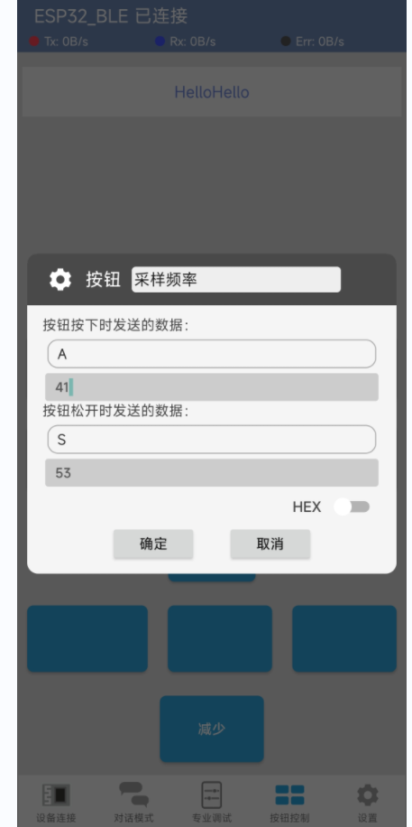    
>2. 设置低功耗蓝牙的识别码
将代码烧录进esp32，在APP端扫描到蓝牙设备后，需要选择与蓝牙配置一样的UUID 。（这里必须要和代码里设置的UUID一一对应！）
点击蓝牙名称旁边的小齿轮

APP端接收到消息后打印的效果：
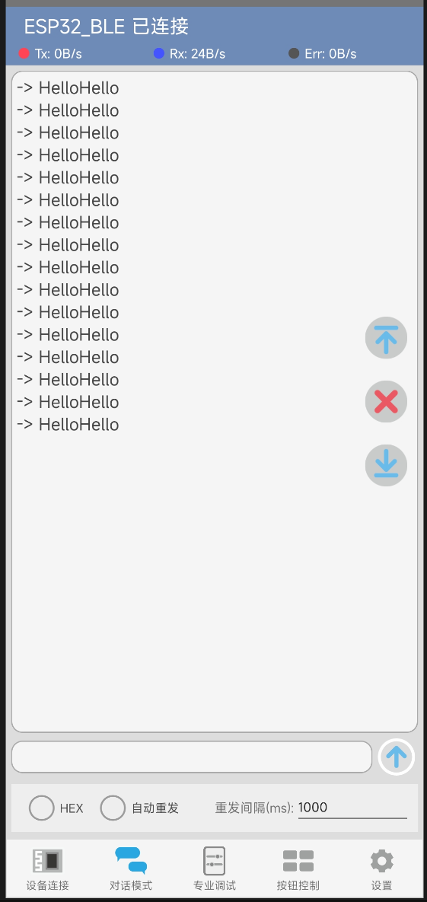
WiFi LoRa 32 (V3) 蓝牙接收到信息后串口输出对应信息：
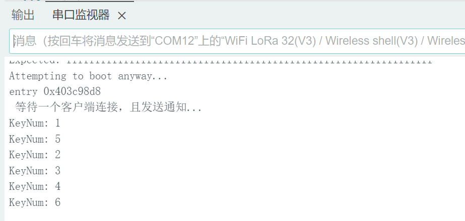

### （3）使用Flash-EEPROM
**为了掉电后也能保存住配置过的信息**
  ```#include <EEPROM.h>

int num = 123;

void setup() {
  Serial.begin(115200);
  EEPROM.begin(4096);    //申请空间，传入参数为size，为需要读写的数据字节最大地址+1，取值1~4096；

  EEPROM.write(20, num);delay(1);   //传入的地址，和传入的数据
  EEPROM.commit();delay(1);  //在写好所有的更改之后，保存更改的数据


    Serial.print("ESP 32 读取模式，取出数据：");
    Serial.println(EEPROM.read(20));  //读数据，里面填写的参数为地址，需要与上面的写入地址一样才可以正常读出上面我们写入的数据   
}

void loop() {


}

  ```
### （4）LORA发送信息

>1. 什么是LoRa   
   LoRa是由Semtech公司提供的超长距离、低功耗的物联网解决方案。Semtech公司和多家业界领先的企业，如Cisco、 IBM及Microchip发起建立了LoRa（Long Range，广距）联盟，致力于推广其联盟标准LoRaWAN技术，以满足各种需要广域覆盖和低功耗的M2M设备应用要求。LoRaWAN目前已有成员150多家，也有数家中国公司参与其中，并且在欧洲数个国家进行了商业部署，国内也开始有了应用。 具有远距离、低功耗、低成本、广覆盖、易部署等优点。
>2. LoRa的主要特点
低速率：低频谱带宽，传输速率从几百到几十Kbps；
低功耗：信号的发送功率超低，理论上一节五号电池可供设备工作10年以上；
远距离：传输距离远，城镇可达2-5 Km ， 郊区可达15 Km ；
成本低：采用免费的频谱资源、单次较低数据量的数据传输、较低的传输频次，使得LoRa的运营成本较低。目前蜂窝网络为高带宽设计，采用蜂窝网络要占用网络和码号资源，还会产生包月流量费用；
工作频率：ISM 频段 包括433、868、915 MH等。
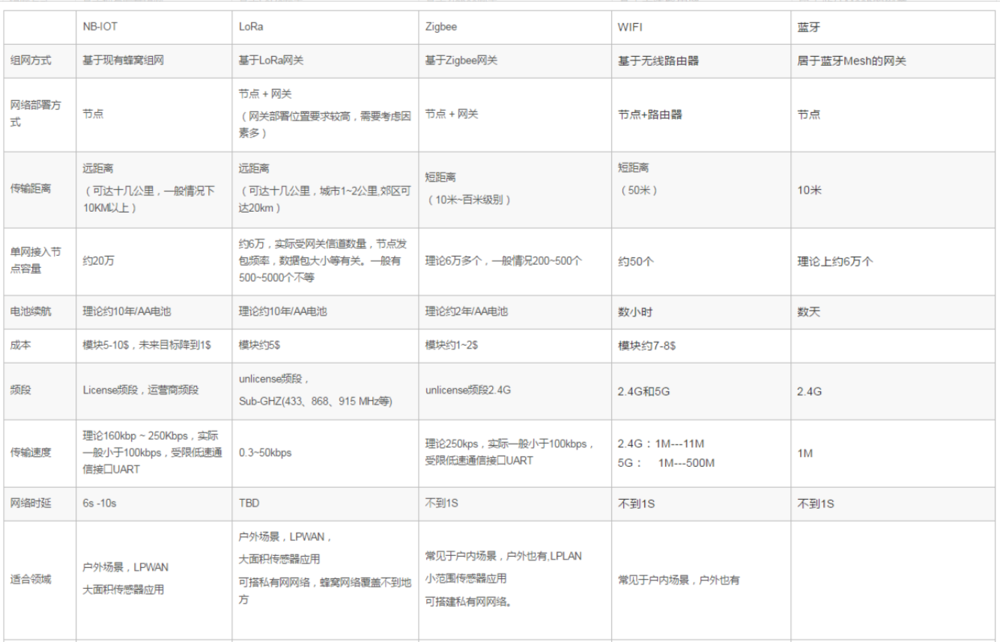
 **参考官方例程，发送和接收端，分别烧录对应代码，关键在于使用的频段需要一致。**
发送端例程：
```#include "LoRaWan_APP.h"
#include "Arduino.h"

//LoRa初始化参数
#define RF_FREQUENCY                                915000000 // Hz       //工作频率
#define TX_OUTPUT_POWER                             5        // dBm       //输出功率
#define LORA_BANDWIDTH                              0         // [0: 125 kHz,   //带宽
                                                              //  1: 250 kHz,
                                                              //  2: 500 kHz,
                                                              //  3: Reserved]
#define LORA_SPREADING_FACTOR                       7         // [SF7..SF12]
#define LORA_CODINGRATE                             1         // [1: 4/5,
                                                              //  2: 4/6,
                                                              //  3: 4/7,
                                                              //  4: 4/8]
#define LORA_PREAMBLE_LENGTH                        8         // Same for Tx and Rx
#define LORA_SYMBOL_TIMEOUT                         0         // Symbols
#define LORA_FIX_LENGTH_PAYLOAD_ON                  false
#define LORA_IQ_INVERSION_ON                        false
#define RX_TIMEOUT_VALUE                            1000
#define BUFFER_SIZE                                 30 // Define the payload size here

char txpacket[BUFFER_SIZE];
char rxpacket[BUFFER_SIZE];
double txNumber;
bool lora_idle=true;

static RadioEvents_t RadioEvents;
void OnTxDone( void );
void OnTxTimeout( void );

void setup() {
    Serial.begin(115200);
    Mcu.begin();
    txNumber=0;
    RadioEvents.TxDone = OnTxDone;
    RadioEvents.TxTimeout = OnTxTimeout;
    
    Radio.Init( &RadioEvents );
    Radio.SetChannel( RF_FREQUENCY );                                        //设置通道
    Radio.SetTxConfig( MODEM_LORA, TX_OUTPUT_POWER, 0, LORA_BANDWIDTH,       //发送设置
                                   LORA_SPREADING_FACTOR, LORA_CODINGRATE,
                                   LORA_PREAMBLE_LENGTH, LORA_FIX_LENGTH_PAYLOAD_ON,
                                   true, 0, 0, LORA_IQ_INVERSION_ON, 3000 ); 
   }

void loop()
{
  if(lora_idle == true)
  {
    delay(1000);
    txNumber += 0.01;
    sprintf(txpacket,"Hello world number %0.2f",txNumber);  //start a package
    Serial.printf("\r\nsending packet \"%s\" , length %d\r\n",txpacket, strlen(txpacket));
    Radio.Send( (uint8_t *)txpacket, strlen(txpacket) ); //把数据发送出去
    lora_idle = false;
  }
  Radio.IrqProcess( );
}

void OnTxDone( void )
{
  Serial.println("TX done......");
  lora_idle = true;
}

void OnTxTimeout( void )
{
    Radio.Sleep( );
    Serial.println("TX Timeout......");
    lora_idle = true;
}
```
 接收端例程：
 ```#include "LoRaWan_APP.h"
#include "Arduino.h"

#define RF_FREQUENCY                                915000000 // Hz  发送和接收的频率必须一致
#define TX_OUTPUT_POWER                             14        // dBm
#define LORA_BANDWIDTH                              0         // [0: 125 kHz,
                                                              //  1: 250 kHz,
                                                              //  2: 500 kHz,
                                                              //  3: Reserved]
#define LORA_SPREADING_FACTOR                       7         // [SF7..SF12]
#define LORA_CODINGRATE                             1         // [1: 4/5,
                                                              //  2: 4/6,
                                                              //  3: 4/7,
                                                              //  4: 4/8]
#define LORA_PREAMBLE_LENGTH                        8         // Same for Tx and Rx
#define LORA_SYMBOL_TIMEOUT                         0         // Symbols
#define LORA_FIX_LENGTH_PAYLOAD_ON                  false
#define LORA_IQ_INVERSION_ON                        false

#define RX_TIMEOUT_VALUE                            1000
#define BUFFER_SIZE                                 30 // Define the payload size here

char txpacket[BUFFER_SIZE];
char rxpacket[BUFFER_SIZE];
static RadioEvents_t RadioEvents;
int16_t txNumber;
int16_t rssi,rxSize;
bool lora_idle = true;
void setup() {
    Serial.begin(115200);
    Mcu.begin();    
    txNumber=0;
    rssi=0;
  
    RadioEvents.RxDone = OnRxDone;
    Radio.Init( &RadioEvents );
    Radio.SetChannel( RF_FREQUENCY );
    Radio.SetRxConfig( MODEM_LORA, LORA_BANDWIDTH, LORA_SPREADING_FACTOR,
                               LORA_CODINGRATE, 0, LORA_PREAMBLE_LENGTH,
                               LORA_SYMBOL_TIMEOUT, LORA_FIX_LENGTH_PAYLOAD_ON,
                               0, true, 0, 0, LORA_IQ_INVERSION_ON, true );
}


void loop()
{
  if(lora_idle)
  {
    lora_idle = false;
    Serial.println("into RX mode");
    Radio.Rx(0);          //进入接收模式
  }
  Radio.IrqProcess( );
}

void OnRxDone( uint8_t *payload, uint16_t size, int16_t rssi, int8_t snr )   //数据接收处理函数
{
    rssi=rssi;
    rxSize=size;
    memcpy(rxpacket, payload, size );
    rxpacket[size]='\0';
    Radio.Sleep( );
    Serial.printf("\r\nreceived packet \"%s\" with rssi %d , length %d\r\n",rxpacket,rssi,rxSize); //将收到的信息打印出来
    lora_idle = true;
}
 ```
 接收端打印效果：


### （5）系统定时器设置
上报频率和检测频率设置，以及整个系统的运行，需要用到定时器作为时间参考。
```hw_timer_t* timer= NULL;  //定义存放定时器的指针

//定时器中断函数
void IRAM_ATTR onTimer()
{
  Serial.println("Hello");
}

void setup() 
{
  Serial.begin(115200);
  timer = timerBegin(0, 80, true);  //设置定时器0，80分频，定时器是否上下计数
  timerAttachInterrupt(timer, onTimer, true);  //定时器地址指针，中断函数名称，中断边沿触发类型
  timerAlarmWrite(timer, 1000000, true);  //操作那个定时器，定时时长单位us，是否自动重装载
  timerAlarmEnable(timer);  //打开哪个定时器

}

void loop() 
{
  // put your main code here, to run repeatedly:
  delay(5000); //验证定时器中断是不是起作用了
}
```
### （5）串口指令
使用串口0作为外部指令接口，自定义指令如下

接收到指令之后做出相应动作
## 2.接收端功能模块介绍
### （1）LoRa无线接收  
**如测量端代码所示**
### （2）Oled显示
**屏幕显示字符串的例程**
```
#include <Wire.h>               
#include "HT_SSD1306Wire.h"

SSD1306Wire  display(0x3c, 500000, SDA_OLED, SCL_OLED, GEOMETRY_128_64, RST_OLED); // addr , freq , i2c group , resolution , rst

void setup() {
  // put your setup code here, to run once:
  display.init();  //屏幕初始化
  display.setFont(ArialMT_Plain_16);   //设置字体
}

void loop() {
  // put your main code here, to run repeatedly:
  display.clear();
  display.drawString(0, 0, "Hello");  //X,Y,内容
  display.display();  //将缓冲区写入内存
  delay(1000);
  display.clear();
  display.drawString(0, 0, "Hi");  //X,Y,内容
  display.display();  //将缓冲区写入内存
  delay(1000);
  
}
```
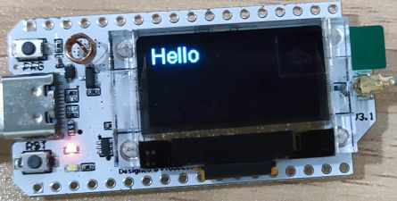


---

# 五.工程代码烧录和手机APP设置
## 1.工程代码烧录
ESP32 检测和显示端完整工程GIthub仓库 https://github.com/CompletelyInsane/ESP32_BLE_Overall.git
>1. 下载工程
   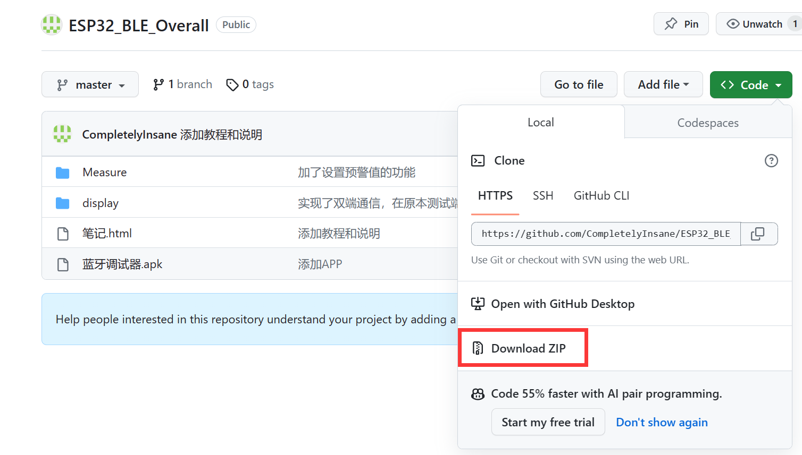
>2. 下载解压，进入目录 
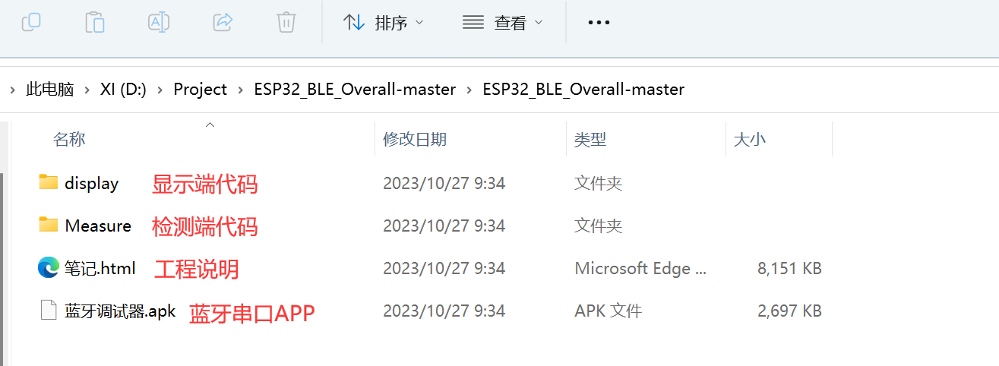
>3. 双击打开工程
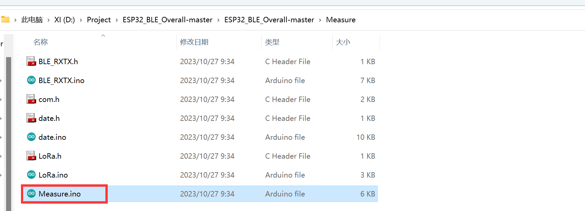
>4. 在设备管理器中查看对应端口
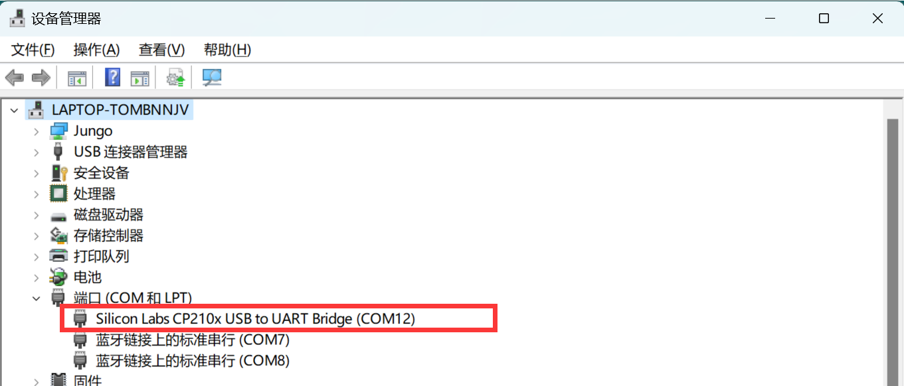
>5. 正确选择开发板和端口
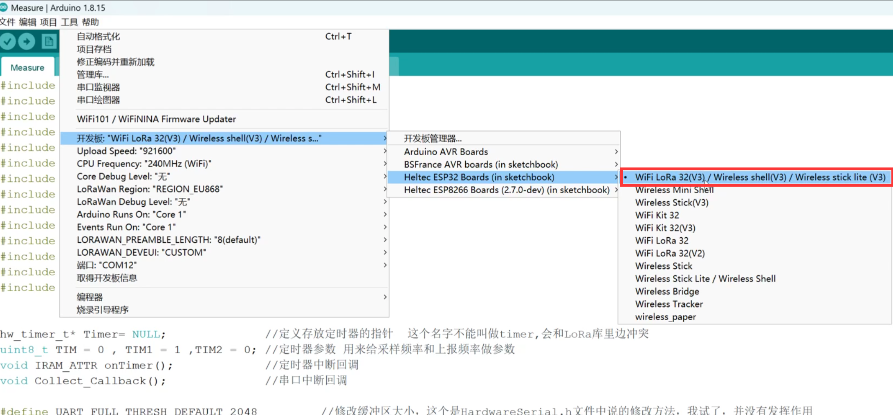

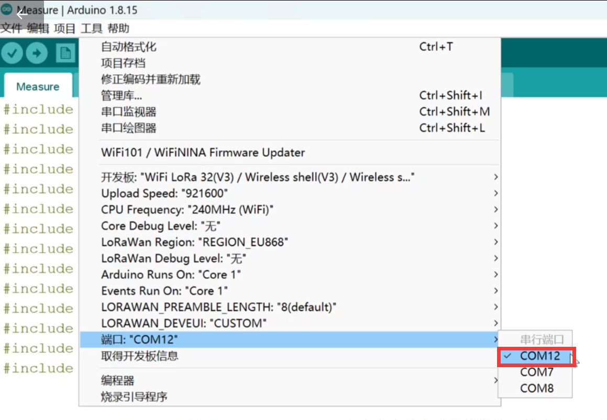
>6. 编译上传
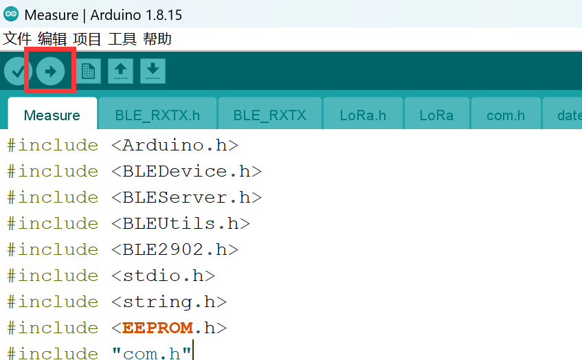
**接收显示端同理**   
## 2.手机蓝牙串口APP设置
>1. 下载GitHub仓库中的APP安装到手机并打开

>2. 找到对应的蓝牙设备，名称为ESP32 _BLE点击小齿轮设置UUID
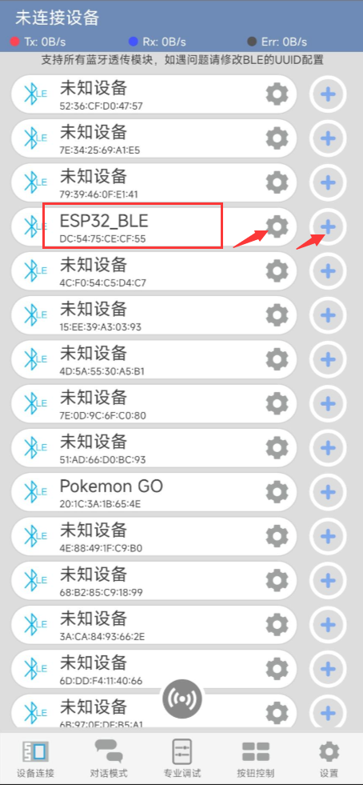

::: alert-info

**UUID必须和代码里设置的一致**
:::
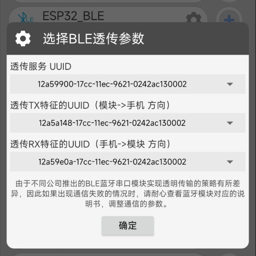
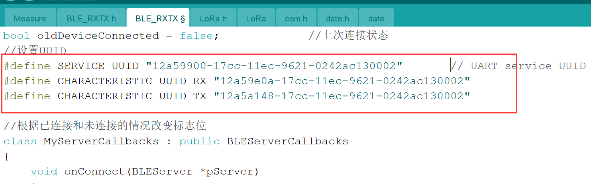
设置好后点击加号连接蓝牙
>3. 点击下方按钮控制，并进入编辑模式
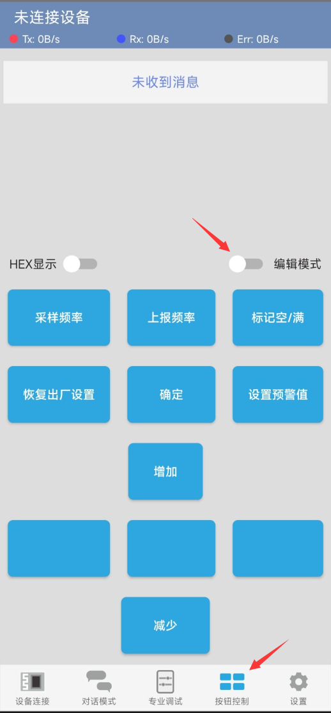

>4. 修改按钮名称以及摁下和松开时发送的数据
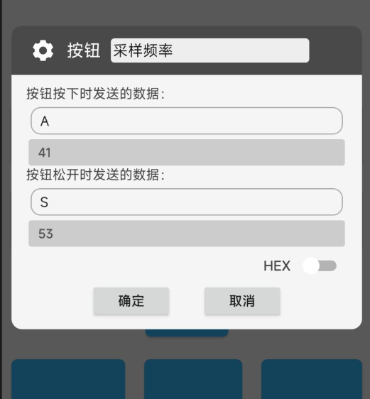

分别为
| 按钮名称    |  采样频率   |   上报频率  |  标记空/满   |  恢复出厂设置   |  确定   |    设置预警值 |   增加  |  减少   |
| :-: | :-: | :-: | :-: | :-: | :-: | :-: | :-: | :-: |
| 摁下发送    |  A   |  B   |   C  |   D  |   E  |  F   |  G   |   K  |
|  松开发送   |    S |    S |   S  |   S  |   S  |   S  |    S |    S |

## 接线图

## 使用说明

::: alert-info

首次启动或恢复出厂设置后默认未标定垃圾桶的空满状态，采样频率为1秒，上报频率为1秒，垃圾桶自动预警的预警值为80%。
需要先标记空状态和满状态，摁下去确定键，即可进行标定。标定完成后自动根据采样频率、上报频率和预警值进行采样和上报垃圾桶状态，显示为百分比。当垃圾桶使用超过预警值时，不再显示垃圾桶状态，而是提醒垃圾桶已满。
摁下采样频率、上报频率、设置预警值后可以进入对应设置，摁增加和减少对数值进行修改，摁确定后写入设置。摁下标记空/满可以重新对空满两种状态进行标定。摁下恢复出厂设置可以重置所有参数，回到初始状态。

:::

### 显示端界面介绍


### 设置端界面介绍
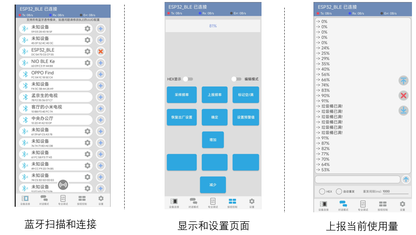


* 每次恢复出厂设置时，并未标记垃圾桶的空置和满溢状态；

* 连接上蓝牙后默认显示标记空状态摁下确定键记录当前雷达读数为垃圾桶空状态；

* 标记空状态后，会自动跳转至标记满状态，摁下确定键后，标记当前状态为垃圾桶完全满溢；

* 完成后系统将存储刚才标记的数据，即使掉电再上电也不会清除；


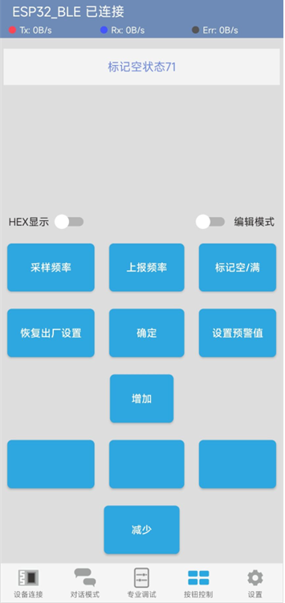

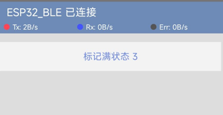

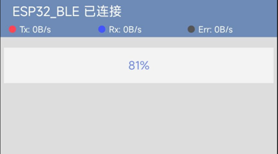


* 系统默认参数为  
          （1）采样间隔1s
          （2）上报间隔1s、
          （3）垃圾桶满溢预警值为80%

* 可以根据需求直接点击按钮进入修改界面

* 按增加/减少更改数据，按确定键写入数据

* 摁恢复出厂设置，将重置所有参数至预设值

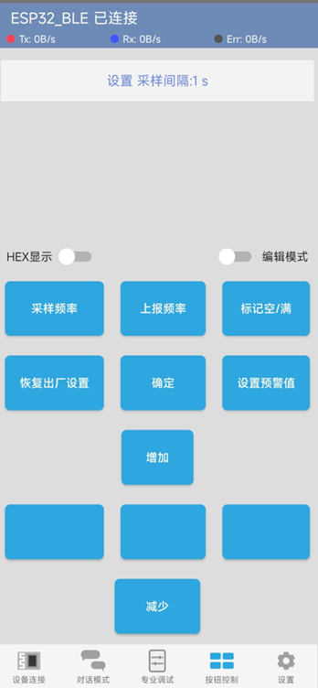

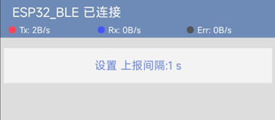


* 检测不到雷达数据时进行报错

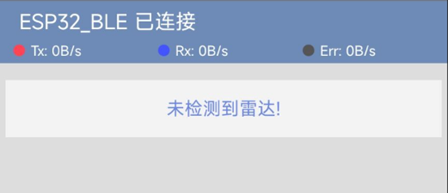

### 串口指令表   波特率：115200  


---
